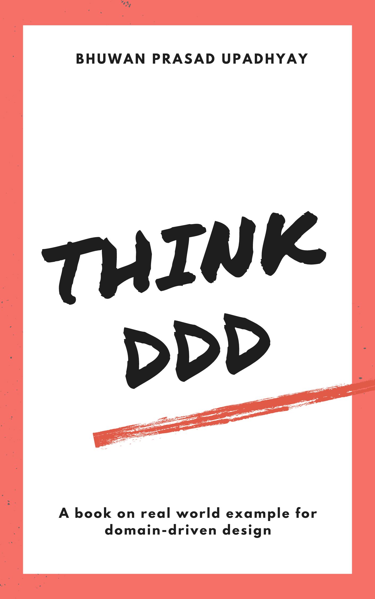

# Think DDD

* This book covers the domain-driven design concepts, building blocks, definitions, design patterns, ddd for microservices, testing, pipeline workflows and best practices for "DDD".
* Book provides complete real world example that apply Domain-Driven Design concepts and patterns for domain layer. Also, explains best practices for designing infrastructure layer and application layers.
* Book mostly focuses on best practices for real time projects rather than theoretical concepts for Domain Layer, Application Layer, Infrastructure Layer, Testing and CI/CD pipelines.

